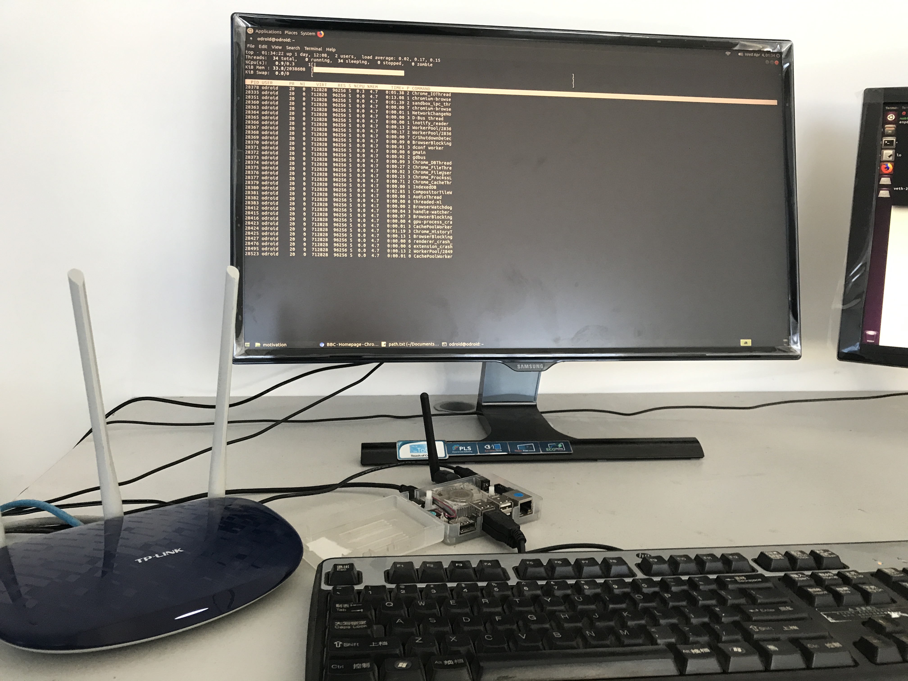

# AMBER

AMBER is a project for improving the user experience of mobile web browser, 
it provides a general and extensible framework for running experiments on moile heterogeneous multi-cores mobile platform.
The core of AMBER is a machine learning based technique to predict which of the heterogeneous
processors to use to render the web content and the operating frequencies of heterogeneous processors.
We implemente it in the open-source Chromium browser.

BBC DEMO

# Features
AMBER evaluates the workload of any new loading webpage, collecting features' value and make normalization(scr/getFeatures)
For example: news.bbc.co.uk.  And then feed the normalized feature values into the offline trained model and output a 
predicted processor configuration under a specified metric(eg. energy).

BBC Feature values

# Scheduler
The scheuler get the extension predicted configuration and scheduler the render process to the specified core with certain 
frequency.

Regular 4G Network Condition.
Renderer running on the core 5(big) with highest frequency under Interactive Governor

Renderer running on the core 0(little) with 0.8Ghz under Our approach

# License
GPL.
